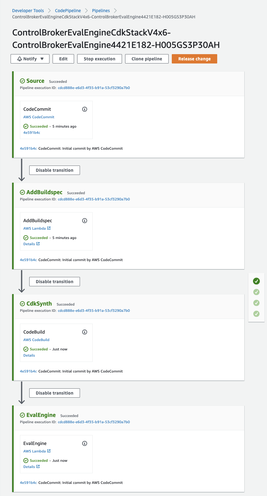
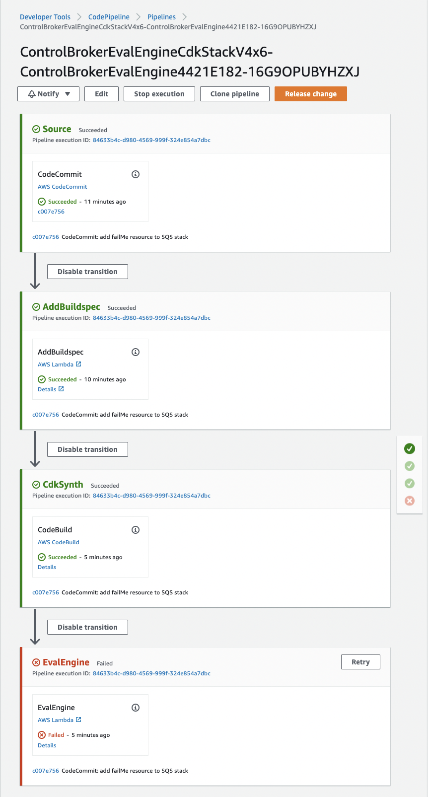

# Control Broker Eval Engine

This is a deep dive on one specific component within Vertical Relevance's 
broader [AWS Control Foundation solution](https://github.com/VerticalRelevance/ControlFoundations-Blueprint).

This repository deploys an Evaluation Pipeline used by a Security Team
to evaluate the IaC proposed by an Application Team’s CDK application.

See the full write-up [here](TODO)


## Setup

Prior to starting the setup of the CDK environment, ensure that you have cloned this repo.

Follow the setup steps below to properly configure the environment and first deployment of the infrastructure.

To manually create a virtualenv on MacOS and Linux:

```
$ python3 -m venv .venv
```

After the init process completes and the virtualenv is created, you can use the following
step to activate your virtualenv.

```
$ source .venv/bin/activate
```

If you are on a Windows platform, you would activate the virtualenv like this:

```
% .venv\Scripts\activate.bat
```

Once the virtualenv is activated, you can install the required dependencies.

```
$ pip install -r requirements.txt
```

Bootstrap the cdk app.

```
cdk bootstrap
```

At this point you can deploy the CDK app for this blueprint.

```
$ cdk deploy
```

After running `cdk deploy`, the pipeline will be set up.

## Walkthrough

### (1)

In the AWS Console, navigate to `CodePipeline` / `Pipelines` and find the pipeline whose name starts with `ControlBrokerEvalEngineCdkStack`. This is our Evaluation Pipeline.

The `Initial commit by AWS CodeCommit` commit occurs when CDK initializes the repository with IaC defined in the  [Application Team Example App](./supplementary_files/application_team_example_app) directory of the Root Evaluation Pipeline CDK application. These files serve only to initialize the CodeCommit repository.

See the screenshot below for the expected state of the Evaluation Pipeline upon the initial deployment.



The initial IaC is compliant, so it should pass the Evaluation Pipeline. Let's modify the Example App to see what happens if we propose noncompliant IaC. 

Check the deployment output for links to clone the Example App CodeCommit repository. See the [documentation](https://docs.aws.amazon.com/codecommit/latest/userguide/setting-up-ssh-unixes.html) for how to setup a CodeCommit ssh conection.

### (2)

Once you have cloned the repository, run `npm install`. As we edit the resources in this TypeScript CDK application, we can run `cdk synth` to confirm our resources compile to CloudFormation successfully. But we will not `cdk deploy` this Example App directly, because the IaC must first be approved by the Evaluation Pipeline.

Next, we'll add a noncompliant resource to the SQS stack. Open the Example App repo and navigate to this path:

```
./supplementary_files/application_team_example_app/lib/control_broker_eval_engine-example_app-stack-sqs.ts 
```

Then uncomment the `failMeQueue` in section (2). Save the file, then commit it to the CodeCommit repository with a commit message like:

```
add failMe resource to SQS stack
```

Return to the CodePipeline console to track the `failMe` commit through the Evaluation Pipeline. It should fail at the EvalEngine stage as seen in the below screenshot.



Let's see the result of the evaluation. In the AWS Console, navigate to `DynamoDB` / `Tables` and find the table whose name starts with `ControlBrokerEvalEngineCdkStack-EvalResults`. These are results of the Evaluation Pipeline.
Select `ExploreTableItems`. The evaluation results of the `failMe` commit should appear here, including the `reason` the IaC was denied along with the metadata defined in the [pipeline-ownership-metadata](/ControlBrokerEvalEngine-Blueprint/supplementary_files/pipeline-ownership-metadata/business-unit-a/eval-engine-metadata.json) file.

The `reason` should match the one specified in the relevant OPA Policy. Check out the [policy governing SQS](./supplementary_files/opa-policies/SQS/sqs_queue_fifo.rego) to compare the configuration of the `failMeQueue` resource we just proposed with the allowed values defined by the OPA Policy.

Note that this table can be queried programatically. Check the logs of the Lambda function prefixed `ControlBrokerEvalEngineCd-EvalEngineWrapper` for the `EvalResultsTablePk` to query the Eval Results table with.

So far we've seen compliant IaC (1) pass and noncompliant IaC (2) fail using the provided OPA Policies.

### (3)

In the final portion of the walkthrough, we'll edit the OPA Policy governing the evaluation. Let's take the noncompliant SQS Queue from (2) and edit the relevant OPA Policy so that it now compliant, then we'll send it back through the Evaluation Pipeline and compare the result.

In our Example App repo, comment out the IaC labeled (1) and (2) and uncomment section (3). Notice that we've simple renamed the SQS Queue that just failed in (2) to `fifoFalseQueueMakeMePass` and left the configuration the same. Commit this with a commit message such as:

```
fifoFalseQueueMakeMePass
```

Now let's edit the OPA relevant Policy to make this non-Fifo Queue compliant.

Within the Root CDK Application, in let's edit the [sqs\_queue\_fifo.rego](./supplementary_files/opa-policies/SQS/sqs_queue_fifo.rego) file. In the `obedient_resources` section, edit the allowed Fifo parameter value to:

```
properties.FifoQueue == false
```

To recap, while in sections (1) and (2) we used a OPA Policy that required a SQS Queue to be Fifo, in section (3) we've edited the Policy to require that same parameter to be `false`.

Save both files and redepoy: `cdk deploy`.

Then, navigate back to the Evaluation Pipeline in the AWS Console.
Remember that when we first commited `fifoFalseQueueMakeMePass`, the original OPA Policy was in place. We expect that to be rejected.

Now that we have redeployed and the changes to the OPA Policy have made their way to S3, let's run it again. 
Select the `Release change` button in the top right of the AWS Console to re-run the pipeline with that same `fifoFalseQueueMakeMePass` commit. That same non-Fifo queue should now be compliant, per the changes we made to the policy. We now expect the Evaluation Pipeline to succeed.

### Conclusion

This concludes our walkthrough. We examined the relationship between the two inputs to the Evaluation Pipeline - the Example App and the OPA Policies. We made alternating changes to the IaC and the OPA Policy to get different results.

Both our Example App and OPA Policies were simple and rather arbitrary for simplicity's sake. As an organization enters the Policy as Code space, they can apply the lessons learned here to increasingly sophisticated applications and security policies.