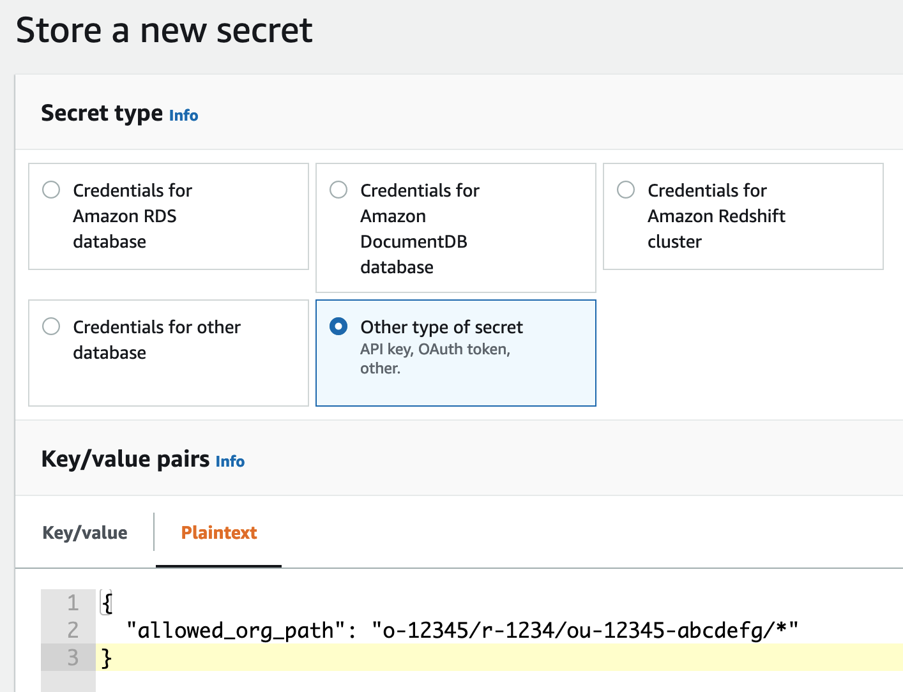
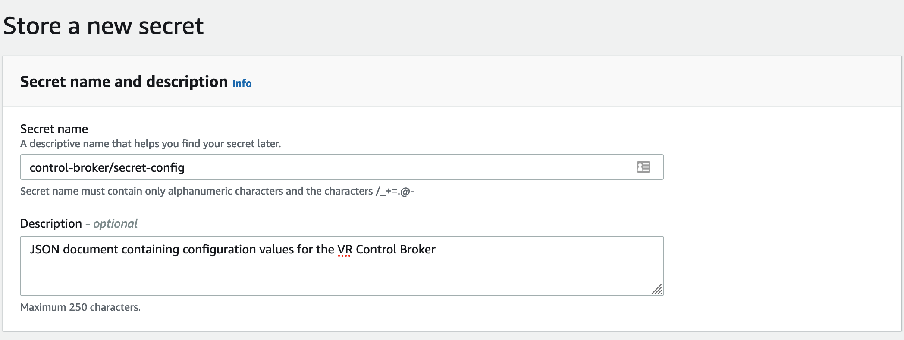

# Control Broker

*Give everyone in your organization subsecond security and compliance decisions based on the organization's latest policies.*

## Versions

This `main` branch represents the (unstable) working branch of the repository.
It contains the latest updates, but is probably not what you want if you
definitely want to deploy a working Control Broker.

For previous stable versions, see the [Releases](https://github.com/VerticalRelevance/ControlBrokerEvalEngine-Blueprint/releases) page.

Please note that this software is meant as a starting point and is therefore not production-ready.

## Features

* Runs a Policy as Code service as a serverless AWS application - you bring the policies, and Control Broker helps you store, organize, and use them - plus it helps you monitor, and analyze their usage.
* Defined in the AWS Python CDK for push-button, repeatable deployment.
* Can be invoked from anywhere in your environment that can invoke a Step Function State Machine (i.e. anywhere that can assume a properly permissioned role), including on-premise and various cloud locations.
* Supports policies written for Open Policy Agent (CloudFormation Guard planned).
* Also helps with notifications, auditing, and analysis of discovered compliance issues.

## Example use cases

* [Using the Control Broker from a CodePipeline application pipeline to block deployment of non-compliant CDK resources](https://github.com/VerticalRelevance/control-broker-codepipeline-example)
* [Using the Control Broker to detect non-compliant changes to deployed resources with AWS Config](https://github.com/VerticalRelevance/control-broker-consumer-example-config)
* [Using the Control Broker from a development machine to evaluate IaC against the organization's latest security policies as it is being written](https://github.com/VerticalRelevance/control-broker-consumer-example-local-dev)

## Deploying Your Own Control Broker

### Upload your secret config file

The Control Broker needs some secret values to be available in its environment. These are stored in a Secrets Manager Secret as a JSON
blob, and the Control Broker's deployment mechanisms grab these values as they need to.

Before proceeding, you'll have to copy [our example secrets file](./supplementary_files/) to a secure location on your machine and replace
the values in it with your own. Then, [create a Secret
in Secrets
Manager](https://docs.aws.amazon.com/secretsmanager/latest/userguide/tutorials_basic.html#tutorial-basic-step1)
called "control-broker/secret-config" with this JSON text as its value.





Here are some helpful hints about what to put in these values:

* `allowed_org_path`: [`aws:PrincipalOrgPaths`](https://docs.aws.amazon.com/IAM/latest/UserGuide/reference_policies_condition-keys.html#condition-keys-principalorgpaths) value to match against. Determines which Orgs/OUs can access your Control Broker results (as long as they possess a valid result token).

> Note: You can change the name of the secret that Control Broker uses by changing the value of the "control-broker/secret-config/secrets-manager-secret-id" context variable.

### Deploy the CDK app

Install the [AWS CDK Toolkit
v2](https://docs.aws.amazon.com/cdk/v2/guide/cli.html) CLI tool.

If you encounter issues running the `cdk` commands below, check the version of
`aws-cdk-lib` from [./requirements.txt](./requirements.txt) for the exact
version of the CDK library used in this repo. The latest v2 version of the CDK
Toolkit should be compatible, but try installing the CDK Toolkit version
matching `requirements.txt` before trying other things to resolve your issues.

Clone this repo to your machine before proceeding.

Follow the setup steps below to properly configure the environment and first
deployment of the infrastructure.

To manually create a virtualenv on MacOS and Linux:

``` $ python3 -m venv .venv ```

After the init process completes and the virtualenv is created, you can use the
following step to activate your virtualenv.

``` $ source .venv/bin/activate ```

If you are on a Windows platform, you would activate the virtualenv like this:

```
% .venv\Scripts\activate.bat
```

Once the virtualenv is activated, you can install the required dependencies.

``` $ pip install -r requirements.txt ```

[Bootstrap](https://docs.aws.amazon.com/cdk/v2/guide/cli.html#cli-bootstrap) the
cdk app:

``` cdk bootstrap ```

At this point you can
[deploy](https://docs.aws.amazon.com/cdk/v2/guide/cli.html#cli-deploy) the CDK
app for this blueprint:

``` $ cdk deploy ```

After running `cdk deploy`, the Control Broker will be set up.

## Next Steps

Try launching one of the [Example use cases](./README.md#example-use-cases)!