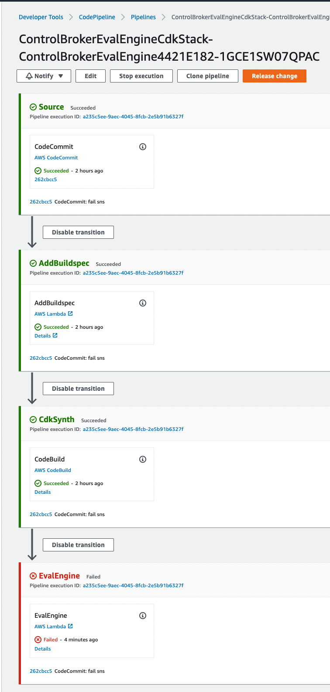

# AWS Controls Foundation - Evaluation Engine Repository

This is a deep dive on one specific component within Vertical Relevance's 
broader (AWS Control Foundation solution)[https://github.com/VerticalRelevance/ControlFoundations-Blueprint].

This repository deploys a pipeline used by Security team
to evaluate the IaC proposed by an Application team’s CDK application
using a serverless Evaluation Engine.


## Prior to starting the setup of the CDK environment, ensure that you have cloned this repo.

## Follow the setup steps below to properly configure the environment and first deployment of the infrastructure.

To manually create a virtualenv on MacOS and Linux:

```
$ python3 -m venv .venv
```

After the init process completes and the virtualenv is created, you can use the following
step to activate your virtualenv.

```
$ source .venv/bin/activate
```

If you are on a Windows platform, you would activate the virtualenv like this:

```
% .venv\Scripts\activate.bat
```

Once the virtualenv is activated, you can install the required dependencies.

```
$ pip install -r requirements.txt
```

Now that the environment is configured, the last step before deploying is you
need to enter your desired git owner and git repos in the parameters section of
the app.py file.

```
# Input parameters. Update according to your github owner and repo.
application_team_cdk_app = {
    'CodeCommitRepository' : <application-team-cdk-repo-name>,
    'Branch' : <application-team-cdk-repo-branch>
}
```

Bootstrap the cdk app.

```
cdk bootstrap
```

At this point you can deploy the CDK app for this blueprint.

```
$ cdk deploy
```

After running cdk deploy, the pipeline will be set up.

## Development/Contribution

To add additional dependencies, for example other CDK libraries, just add
them to your `requirements.txt` file and rerun the `pip install -r requirements.txt`
command. It is preferable to use `pip freeze -r requirements.txt > requirements.txt`
to generate `requirements.txt` with every required package and the required
version of each rather than adding the package to requirements.txt without a
version specfifier. Just make sure to edit the `-e <github URL>` line to be `-e .`
before committing, since `pip freeze` freezes the exact GitHub commit hash URL for
installation, which could break your setup in the future.

## Useful commands

 * `cdk ls`          list all stacks in the app
 * `cdk synth`       emits the synthesized CloudFormation template
 * `cdk deploy`      deploy this stack to your default AWS account/region
 * `cdk diff`        compare deployed stack with current state
 * `cdk docs`        open CDK documentation

## Screenshots

Once you have deployed the solution, you should see a pipeline like the following:

