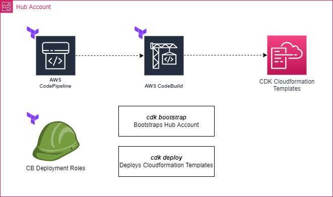

# Purpose
The purpose of the Terraform wrapper is to facilitate deployments of CDK applications with Terraform deployments.

# Overview
Often times at clients it's required that deployments be made through the use of Terraform. However, it has become Vertical Relevance standard to create solutions and modules in AWS CDK. By wrapping CDK Application deployments into an AWS-native CodePipeline build & deployment, we can satisfy Terraform deployment requirements, when it is required.

The diagram below illustrates the Terraform deployments, as well as the CodePipeline process, for deploying CDK applications with Terraform and AWS-native CI/CD components.

    

# Development

## Prerequisites
- Terraform 1.2.9 or higher. Usage of prior versions has not, at the time of this writing, been tested. This version is available within Terraform Cloud Enterprise, which is what this code base was originally targeted to deploy from
- You must have your AWS credential configured in your bash shell to the target deployment environment. Be sure that the region configuration is also set to the desired target region of the deployment. **Ensure this in your configured AWS Credentials, and also be sure to set it in the [backend.tf](./backend.tf) file's `provider {...}` block configuration.**

## CDK Application Integration
Often times organizations have strict naming conventions and requirements for deployment. To accomodate this, the Terraform wrapper has been abstracted as much as reasonably possible so that resource deployments can be dynamically named. **It is important to be aware that the CodePipeline/CodeBuild portions of the wrapper will likely have to be modified so that resources provisioned with CDK itself can also be dynamically named.**

### Parameters
The following are the parameters of the project that are not specific to any CDK deployment. The defaults for these values are defined and set in the [ops/variables.sh](./ops/variables.sh) via the `TF_VAR_` default environment variable conventions, as documented [here](https://www.terraform.io/cli/config/environment-variables#tf_var_name).

## Development/Integration with Terraform Cloud
In addition to the sections below specifically supplying additional instructions for Terraform Cloud Deployment & Teardown, it is likely that you will want to move default Terraform environment variable values to be defined as default values within the [variables.tf](./variables.tf) file itself. 

**Either way, the variables need to be created in the Variables section of the Workspace configuration within Terraform Cloud.**

## Deployment

### Configuring the backend for Terraform Cloud
If you are running this deployment from Terraform Cloud, follow these instructions to properly configure the backend withing the code base:
- In the [backend.tf](./backend.tf) file, comment out the `backend "local" {}` portion and uncomment the `cloud {...}` portion in the `terraform {...}` configuration block of the file.
- Update the configuration values of the `cloud {...}` configuration block to be consistent with your Terraform Cloud Workspace names. Don't forget to update the 'organization' name.

### Local Deployment
Local (development) deployment can be accomplished by navigating to the [ops/](./ops/) folder in a bash shell, and running the `. ./deploy.sh` command.

## Teardown
There are 2 major steps in tearing down resources from Terraform Cloud. Perform the first step discussed below, and then perform the last step, depending on whether you are developing from local or running teardown from Terraform Cloud:
1) Change the `CDK_DEPLOY` Terraform variable value to `"false"`. **Run the plan and apply, as usual. This will teardown the CDK deployment in the CodeBuild execution.**

### Teardown from Terraform Cloud
2) Destroy the Terraform deployments in the target account by following [these instructions](https://learn.hashicorp.com/tutorials/terraform/cloud-destroy) in the Terraform Cloud documentation.

### Local Teardown
2) Local (development) teardown can be accomplished by navigating to the [ops/](./ops/) folder in a bash shell, and running the `. ./deploy.sh` command.

